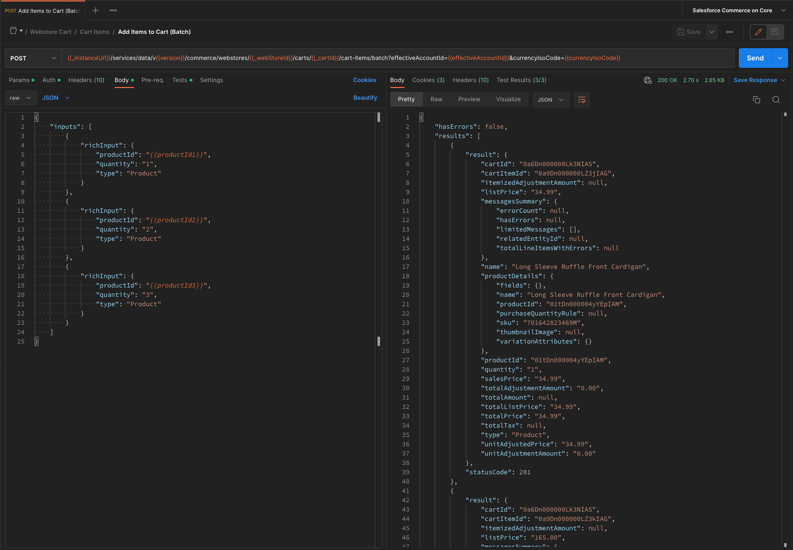

# Salesforce Commerce on Core Postman Collection

This repository contains a sample Postman collection that you can leverage to place orders using the [Salesforce Commerce on Core APIs](https://developer.salesforce.com/docs/atlas.en-us.chatterapi.meta/chatterapi/connect_resources_commerce.htm).

## :gear: Get started

In order to start with this collection, please follow these steps:

1. Download Postman from the [official website](https://www.postman.com/downloads/) and install it
2. Once installed, open Postman
3. Once opened, import the collection and the environment from this repository to your Postman workspace
4. Once imported, open the `Salesforce Commerce on Core` environment, and modify all the data which contain placeholders (like `<YOUR-CLIENT-ID>`) with your details. Please **don't modify the values with `{{` and `}}`, as these values are calculated values within your Postman environment.**. The environment also contains sample values that you can use, or modify, as per your needs.
5. Once the environment is setup, open the `Salesforce Commerce on Core` collection, and start using it.

## :gear: Where do I find these setup values?

This Postman collection authenticates with the Salesforce instance by using the [OAuth 2.0 Username-Password Flow for Special Scenarios](https://help.salesforce.com/s/articleView?id=sf.remoteaccess_oauth_username_password_flow.htm&type=5). Please refer to this documentation to understand how this works.
As per the documentation, you need to create a [Connected App](https://developer.salesforce.com/docs/atlas.en-us.api_rest.meta/api_rest/intro_oauth_and_connected_apps.htm) to be able to use this way of authentication.

### authTokenUrl

If you are using this Postman collection against a sandbox, the `url` environment variable is `https://test.salesforce.com`, else it is `https://login.salesforce.com`. You can also use the url of your instance directly, like `https://[your-domain].my.salesforce.com` if you set up a domain in the org.

### clientId and clientSecret

The `clientId` and `clientSecret` environment variables are the `Consumer Key` and `Consumer Secret` values from the created connected app
In order to get them, please do the following steps:
1. Go to your instance
2. Go to the gear on the top right, and click on `Setup`
3. In the left sidebar, search for `App Manager`
4. Open the connected app you created in the beginning of this chapter
5. Click on the `copy` button to copy the `Consumer Key` and use it as the `clientId` environment variable
5. Click on the `Click to reveal` and `copy` button to copy the `Consumer Secret` and use it as the `clientSecret` environment variable

### username and password

As this Postman collection uses the `OAuth 2.0 Username-Password Flow for Special Scenarios`, it requires your username, password and security token.
Please use the username you use to authenticate against the org as the `username` environment variable, and your password as the `password` environment variable.

### secretToken

As said in the previous section, this collection uses the `OAuth 2.0 Username-Password Flow for Special Scenarios`. This requires you to generate a security token, and use it as the `secretToken` environment variable.
In order to generate it, please do the following steps:
1. Go to your instance
2. Click on your use avatar on the top right and click on `Settings`
3. In the left sidebar, click on `Reset My Security Token`
4. Click on the `Reset My Security Token` button. This will email you with the security token

## :asterisk: Endpoints Covered

#### :hash: Auth Salesforce API
1. Authentication Salesforce API (required)

#### :hash: Webstore
1. Query Webstore (required)

#### :hash: Webstore Product Import
1. Retrieve WebStoreCatalog
2. Retrieve Content Document
3. Retrieve ManagedContentSpace
4. Retrieve Original Pricebook
5. Retrieve Sales Pricebook
6. Retrieve Entitlement Policy
7. Import Sample Products
8. Import Product CSV

#### :hash: Webstore Products
1. Get Products
2. Get Product Details

#### :hash: Webstore Cart

##### :hash: Query Carts
1. Query Carts by AccountId
2. Query Carts by WebStoreId

##### :hash: Get Cart
1. Get Active Cart
2. Get Cart by ID
3. Query Carts

##### :hash: Delete Cart
1. Delete Active Cart
2. Delete Cart by ID

##### :hash: Create Cart
1. Create a Cart

##### :hash: Cart Items
1. Add Item to Cart
2. Add Items to Cart (Batch)
3. Get Cart Items
4. Delete Cart Item
5. Patch Cart Item (**_not yet supported for B2CE_**)

#### :hash: Webstore Checkout
1. Create Checkout
2. Patch Delivery Address
3. Get Checkout Status
4. Patch Delivery Method
5. Create Payment Token
6. Authorize Payment
7. Cart to Order

#### :hash: Checkout - Happy Path
1. Authentication Salesforce API
2. Get Webstore
3. Delete Active Cart
4. Create a Cart
5. Add Items to Cart
6. Create Checkout
7. Patch Delivery Address
8. Create Payment Token
9. Authorize Payment
10. Cart to Order

## :rocket: How to?

### How to use the collection?

You can leverage this collection in different ways:

:arrow_forward: By using any endpoint one-by-one. Please remember to always authenticate and fetch your webstore first.

:next_track_button: By using the [Postman Runner](https://learning.postman.com/docs/running-collections/intro-to-collection-runs), which will run a full folder directly, by executing each endpoint one-by-one, sequentially, and report the unit tests results for each executed endpoint.

